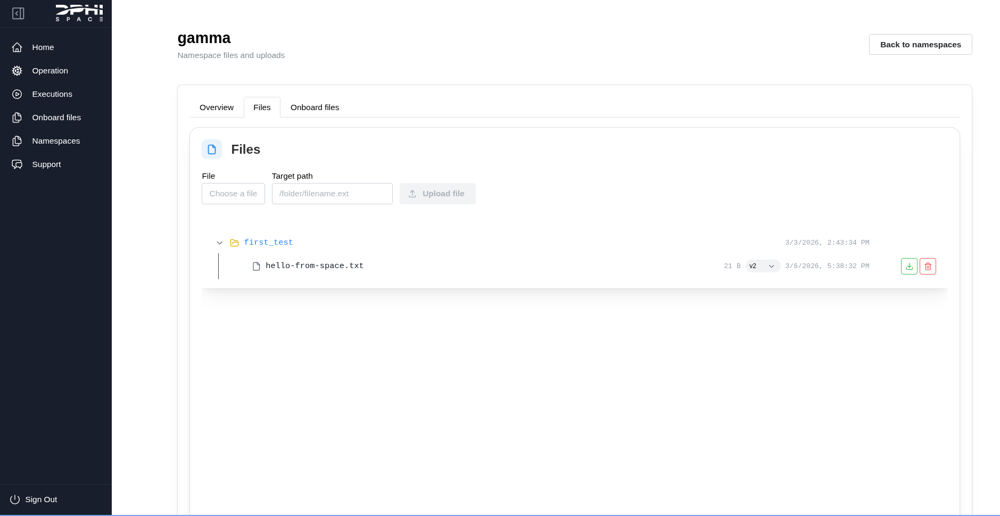

# Namespaces

All artifacts are logically isolated by namespaces to improve organization. A namespace can be thought of as a folder for your operations. Similar to folders in a file system, namespaces can be used to organize operations into logical categories, such as EM Testing, FM Operations, and Debugging.

They help group related operations and files. Each namespace has its own file area.

## Namespace name

A namespace name can be built from alphanumeric characters with no spaces, *e.g.*:

- `em_testing`
- `space-op-1`
- `fm`


## Organizing operations and files

When creating an operation, the namespace must be defined in the operations YAML definition:

```YAML
id: test-health
namespace: gamma
description: Example execution with CG2 downlink task.
tasks:
- id: downlink_results
  type: dphi.space.cg2.downlink
  description: Downlink files to ground
  source:
  - hello-from-space.txt
  destination: /first_test
  volume: payload
```

Once this operation is created, it will be linked to the `gamma` namespace. 

## Files 

The namespaces tab will show all of the artifacts that are linked with the given namespace, such as files onground, operations and executions.


