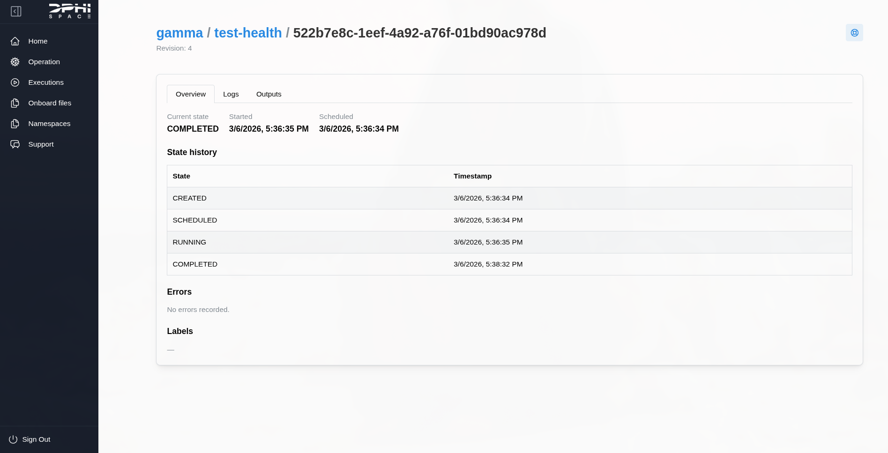
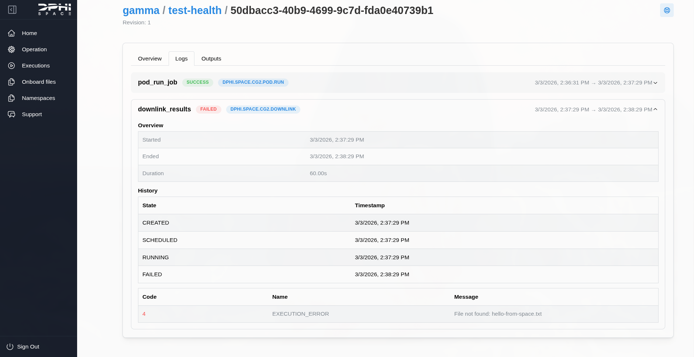
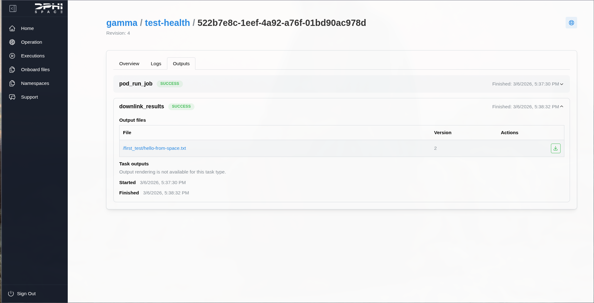

# Executions

## Overview
Executions are the running instances of operations. They are single runs of a targeted operation. Once an operation is scheduled to execute for a given DPhi system (Clustergate-2 EM or FM, for example), the associated worker decodes the operation's YAML file and executes it task by task. This creates a task run for each task in the operation's task list.

When an operation is requested, it spawns an execution instance. You can inspect its details as shown below:

Here you can see the execution state history as well as its associated logs and outputs.

## Typical flow
1. Create or update an operation definition.
2. Execute the operation and monitor task states.
3. Review logs and download outputs as needed.

---

## Tasks 

### Logs tab

The task history can be inspected under the logs and outputs tabs. It displays task metadata and state history, as well as any logs associated with a task.

Each task run has associated metadata, such as:

- Execution ID
- Task ID
- State
- Start and End Dates

This can provide insight into why execution failures might occur, such as in the following example:

Here we see that the task failed to downlink the file (`hello-from-space.txt`) from the user's volume onboard Clustergate-2 because the file did not exist.

### Outputs tab

On the run below, the downlink task on Clustergate-2 ([`dphi.space.cg2.downlink`](/docs/3-dashboard/4-tasks/cg2/downlink.md)) was successful and generated the following output:

This output can be directly downloaded to the user's PC by clicking the green button to the right of the file. Otherwise, clicking the file name redirects the user to the namespace tab, where the file is highlighted.
