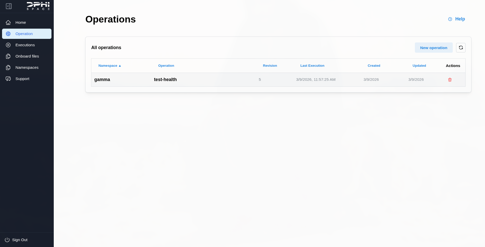
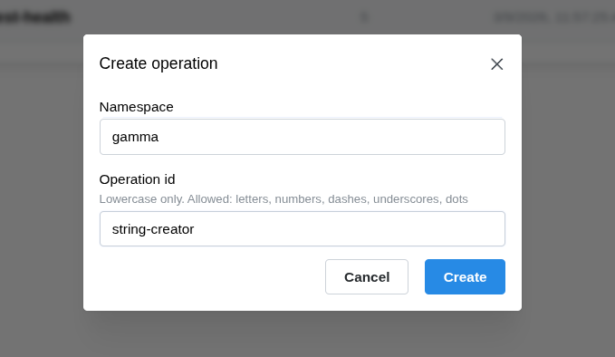
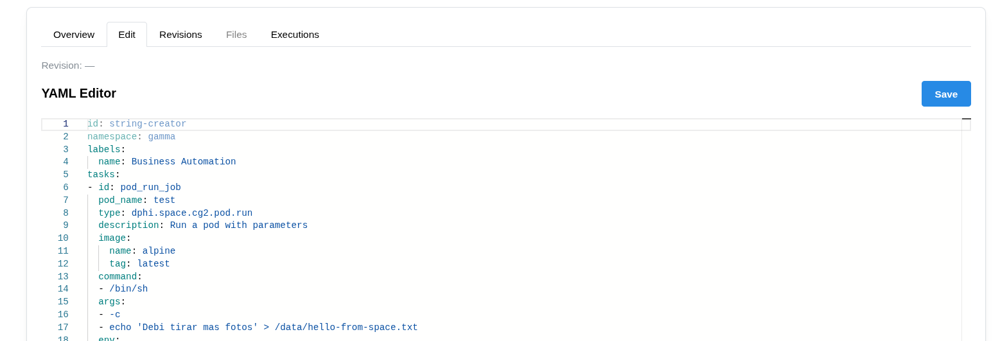
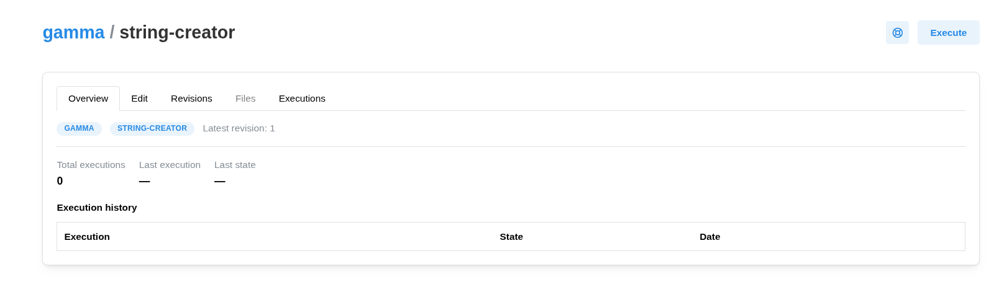

# Dashboard Pipeline
This example defines an operation that runs a DPhi Pod on Clustergate-2 EM and downlinks a file generated by that run.

## Setup
1. Go to the dashboard operations view and create a new operation.


Operation list view.


Operation creation dialog.


2. You will be redirected to the operation overview tab. Open the edit tab to view the operation YAML definition.


Operation edit view.

3. Replace the YAML with the example below, then save it so the backend can validate the definition. When validation succeeds, the execute button appears in the top right.

```yaml
id: test-health
namespace: gamma
description: Example execution with multiple Clustergate-2 tasks.
tasks:
  - id: pod_run_job
    pod_name: test
    type: dphi.space.cg2.pod.run
    description: Run a pod with parameters
    image:
      name: alpine
      tag: latest
    command:
      - /bin/sh
    args:
      - -c
      - echo 'Hello from Clustergate-2' > /data/hello-from-space.txt
    node: Fpga
    max_duration_seconds: 60
    scheduled_time: null
  - id: downlink_results
    type: dphi.space.cg2.downlink
    description: Downlink files to ground
    source:
      - hello-from-space.txt
    destination: /first_test
    volume: payload
```

Save it such that the backend can validate the whole source code. Once this is done, the *Execute* button appears to the top right of the view.

## Execute
Now that the operation definition is validated and ready, execute it from the top right.


Execute button in the operation view.

## Verify outputs
1. Open the execution details to view task logs and outputs.
2. In the outputs tab, confirm the downlink task produced the archive.
3. Download the file using the green download button or open the namespace view to see it under `/first_test`.

## Expected outputs
The downlink task should produce outputs similar to the following:

```yaml
files:
  - path: /first_test/hello-from-space.txt
uri: <download-uri>
contentType: <archive-mime-type>
contentLength: <bytes>
```

## What this operation does
- The `pod_run_job` task runs a container and writes `hello-from-space.txt` to the mounted payload volume.
- The `downlink_results` task pulls that file from onboard storage into the namespace file area.
